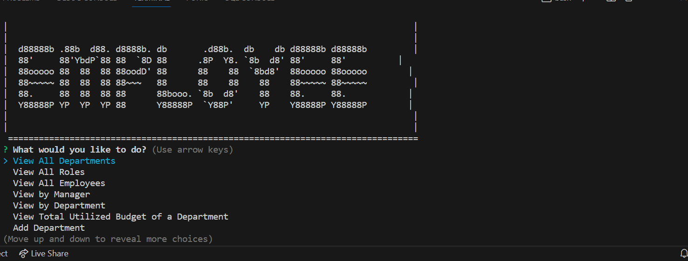
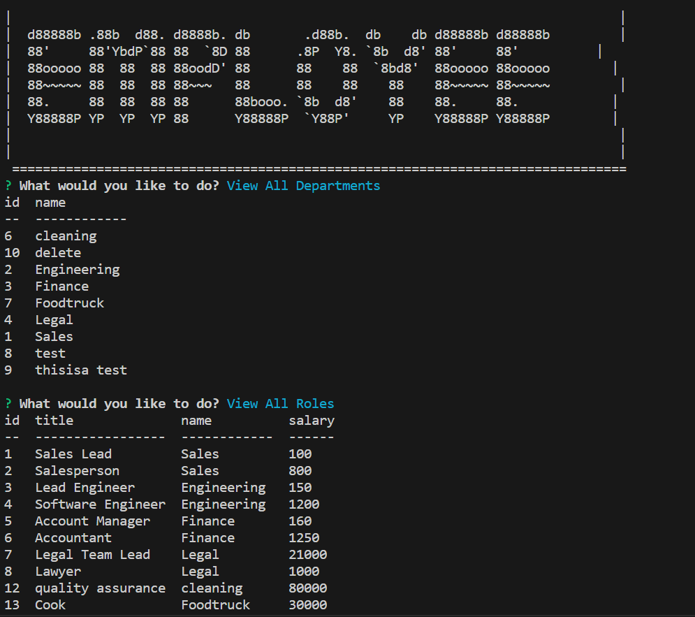

# Employee Tracker



## Description

This is a Javascript command-line application that views and interacts with information stored in a database -- specifically, a company database. The company database has three main tables: Department, Role, and Employee.

### Department Table

The department table includes the id and name of the department.

### Role Table

The role table consists of the name of the role, the salary for that role, and the department id on where that role is under. The department id also links the role and the department tables.

### Employee Table

The employee table consists of the employee's id number, first name and last name, role id and manager id that links the record to the role table and employee table respectively.

The tables are linked as shown:


The application lists an selection of commands that can be used to interact with the data from the database. In general, the user can either view data, add or update employee details, and delete records from the tables.

The user can view the following information:

- View All Departments
- View All Roles
- View All Employees
- View Employees by Manager
- View Employees by Department
- View Total Utilized Budget of a Department - this shows the total salary of the employees under the selected department

The user can also add or delete departments, roles, and employees.
When a role is added, the user will be prompted to select on which department the role is under. When adding an employee record, the application will ask which role the employee would be assigned to and if the new employee is to be assigned to a manager.

The user can update the employee's role or manager.

This program is ran using Node.js with modules Inquirer and MySQL2 that handles the questions and their corresponding answers, and the connection to the database respectively.

## Demonstration of the Application

The program is run in the command line, giving the user a selection of actions. After selecting a command, the application would either show the table with the records or ask additional questions about the command.




## Installation

After forking the project, run the code below to install the modules needed to run this program:

```
npm install
npm init -y
npm i inquirer@8.2.4
npm i mysql2
npm i dotenv
npm i console.table
```

Also run the following in mysql to create the database and also seed the database with sample records.

```
mysql -u root -p
source ./db/schema.sql
source ./db/seed.sql
```

## Usage

To run the program, run the code below:

```
npm start
```
